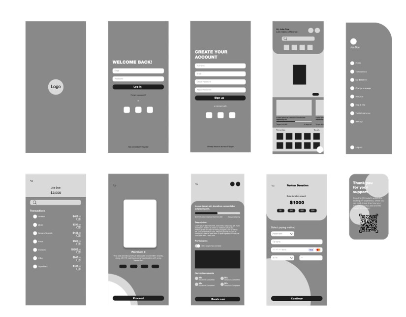
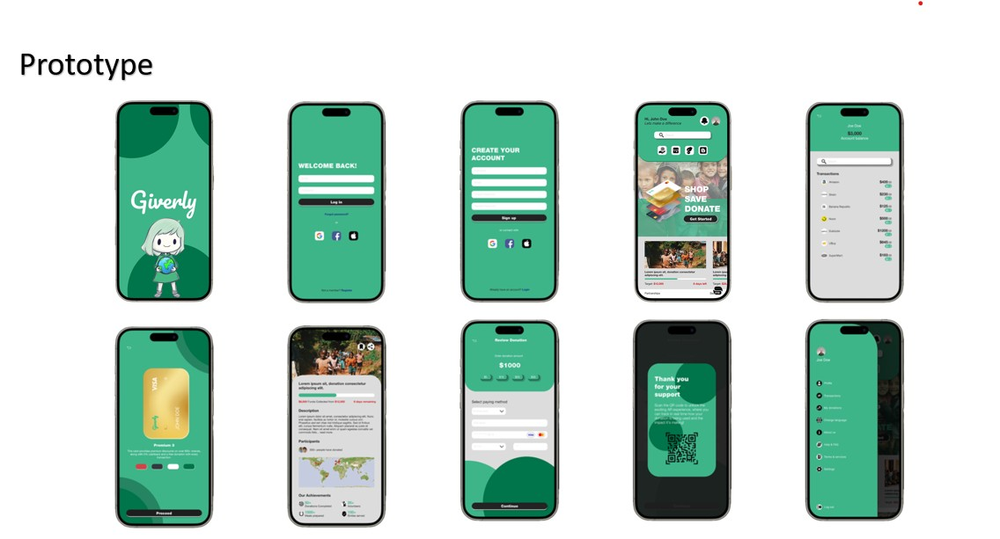

# 📊 Giverly Information Systems Capstone Project

## 📌 Overview

This capstone project demonstrates business systems analysis, UX design, stakeholder management, and AI integration for Giverly — a fintech lifestyle company expanding into the UAE. It applies Design Thinking principles to deliver strategic insights and an AI-powered philanthropic solution tailored to cultural, regulatory, and technological needs.

---

## 🎯 Objectives

- Address Giverly’s market expansion challenges into the UAE
- Align platform features with local user behavior and fintech compliance
- Design intuitive, accessible, and secure digital experiences
- Integrate AI features to drive personalization, engagement, and transparency

---

## 📂 Project Documents

| Document                                                                                                                                                                       | Description                                                      |
| ------------------------------------------------------------------------------------------------------------------------------------------------------------------------------ | ---------------------------------------------------------------- |
| [📄 Business Requirements Document - BRD](./docs/Business%20Requirements%20Document%20-%20BRD.pdf)                                                                             | Defines business needs, goals, and stakeholder requirements      |
| [📄 Project Plan](./docs/Project%20Plan.pdf)                                                                                                                                   | Timeline, resources, milestones, and implementation roadmap      |
| [📄 Business Systems Analyst Capstone – AI Integration & UX Strategy](./docs/Business%20Systems%20Analyst%20Capstone%20%E2%80%93%20AI%20Integration%20%26%20UX%20Strategy.pdf) | Strategic and technical solution aligning AI with UX for Giverly |

---

## 🎨 Design Artifacts

### 🧍 Personas

### 🗺️ Customer Journey

### 🧩 Wireframes

### 🚀 Prototype

---

## 🛠️ Technologies Used

| Tool                    | Purpose                                        |
| ----------------------- | ---------------------------------------------- |
| **Jira and Confluence** | Task management, user stories, sprint tracking |
| **Figma**               | Personas, wireframes, UI/UX prototypes         |
| **Canva**               | Journey maps and stakeholder visualizations    |

---

## 🧠 AI Strategy Features (Summary)

- **AI-Powered Micro Donations**: Round-up logic & behavioral suggestions
- **Real-Time Donation Impact Reports**: Transparency and donor feedback
- **Virtual Reality Empathy Simulator**: Immersive donation experience
- **AI-Powered Fraud Detection & Biometrics**: Secure and trustworthy platform
- **Machine Learning Recommendations**: Cause & campaign matching

---

## ✍️ Author

**Rene Allen Garcia**  
Business Systems Analyst | ECBA Certified  
[LinkedIn Profile](https://linkedin.com/in/reneallengarcia)

---
